# System Architecture - ServiceNow CMDB Audit App

## Overview

The ServiceNow CMDB Audit App is a React-based single-page application that provides comprehensive CMDB analysis and visualization capabilities. The system integrates with ServiceNow via REST APIs to discover, analyze, and visualize CMDB structure and customizations.

## High-Level Architecture

```
┌─────────────────────────────────────────────────────────────────┐
│                    Client Layer (React SPA)                     │
├─────────────────────────────────────────────────────────────────┤
│  ┌─────────────┐  ┌─────────────┐  ┌─────────────┐  ┌─────────┐ │
│  │ Connection  │  │    Graph    │  │    Audit    │  │ Reports │ │
│  │    Test     │  │Visualization│  │   Engine    │  │Dashboard│ │
│  └─────────────┘  └─────────────┘  └─────────────┘  └─────────┘ │
├─────────────────────────────────────────────────────────────────┤
│                   Service Layer (API & State)                   │
├─────────────────────────────────────────────────────────────────┤
│  ┌─────────────┐  ┌─────────────┐  ┌─────────────┐  ┌─────────┐ │
│  │ ServiceNow  │  │    CMDB     │  │    Audit    │  │  Cache  │ │
│  │   Service   │  │   Service   │  │   Service   │  │ Manager │ │
│  └─────────────┘  └─────────────┘  └─────────────┘  └─────────┘ │
├─────────────────────────────────────────────────────────────────┤
│                   Data Layer (External APIs)                    │
├─────────────────────────────────────────────────────────────────┤
│  ┌─────────────────────────────────────────────────────────────┐ │
│  │            ServiceNow REST APIs                            │ │
│  │  ┌─────────────┐ ┌─────────────┐ ┌─────────────────────┐   │ │
│  │  │sys_db_object│ │sys_dictionary│ │    cmdb_rel_ci      │   │ │
│  │  └─────────────┘ └─────────────┘ └─────────────────────┘   │ │
│  └─────────────────────────────────────────────────────────────┘ │
└─────────────────────────────────────────────────────────────────┘
```

## Component Architecture

### Frontend Components

#### 1. Application Shell
```typescript
interface AppShell {
  header: HeaderComponent;
  navigation: NavigationTabs;
  content: ContentArea;
  notifications: NotificationSystem;
}

// Main navigation tabs
enum NavigationTab {
  CONNECTION = 'connection',
  GRAPH = 'graph', 
  AUDIT = 'audit',
  REPORTS = 'reports'
}
```

#### 2. Connection Management
```typescript
interface ConnectionComponents {
  connectionTest: ConnectionTestComponent;
  instanceConfig: InstanceConfigComponent;
  connectionStatus: ConnectionStatusComponent;
  credentialForm: CredentialFormComponent;
}

interface ConnectionState {
  instance: ServiceNowInstance;
  status: ConnectionStatus;
  lastTest: Date;
  capabilities: InstanceCapabilities;
}
```

#### 3. Graph Visualization
```typescript
interface GraphComponents {
  graphContainer: CMDBGraphContainer;
  inheritanceTree: TableInheritanceTree;
  relationshipNetwork: RelationshipNetworkGraph;
  graphControls: GraphControlPanel;
  nodeDetails: NodeDetailsPanel;
}

interface GraphState {
  viewMode: 'inheritance' | 'relationships' | 'combined';
  selectedNodes: TableNode[];
  filterCriteria: GraphFilter;
  layoutSettings: LayoutConfiguration;
}
```

#### 4. Audit Engine
```typescript
interface AuditComponents {
  auditDashboard: AuditDashboardComponent;
  testRunner: AuditTestRunner;
  resultsViewer: AuditResultsViewer;
  customTableReport: CustomTableReportComponent;
  customFieldReport: CustomFieldReportComponent;
}

interface AuditState {
  activeTests: AuditTest[];
  results: AuditResult[];
  progress: AuditProgress;
  history: AuditHistory[];
}
```

#### 5. Reporting System
```typescript
interface ReportComponents {
  reportBuilder: ReportBuilderComponent;
  reportViewer: ReportViewerComponent;
  exportManager: ExportManagerComponent;
  reportScheduler: ReportSchedulerComponent;
}

interface ReportState {
  templates: ReportTemplate[];
  activeReport: Report;
  exportFormats: ExportFormat[];
  scheduledReports: ScheduledReport[];
}
```

## Service Layer Architecture

### 1. ServiceNow API Service
```typescript
class ServiceNowService {
  // Core API methods
  async testConnection(instance: ServiceNowInstance): Promise<ConnectionResult>;
  async makeAuthenticatedRequest(endpoint: string, options?: RequestOptions): Promise<Response>;
  
  // Table discovery
  async getTables(filter?: TableFilter): Promise<TableMetadata[]>;
  async getTableSchema(tableName: string): Promise<TableSchema>;
  
  // Data retrieval
  async getRecords(table: string, query?: string, limit?: number): Promise<Record[]>;
  async getRecordCount(table: string, query?: string): Promise<number>;
}
```

### 2. CMDB Analysis Service
```typescript
class CMDBService {
  // Structure analysis
  async getTableHierarchy(): Promise<TableHierarchy>;
  async getTableRelationships(): Promise<TableRelationship[]>;
  async getReferenceFields(): Promise<ReferenceField[]>;
  
  // CI relationship analysis
  async getCIRelationships(ciId?: string): Promise<CIRelationship[]>;
  async getRelationshipTypes(): Promise<RelationshipType[]>;
  
  // Inheritance mapping
  async buildInheritanceTree(): Promise<InheritanceTree>;
  async getChildTables(parentTable: string): Promise<string[]>;
}
```

### 3. Audit Service
```typescript
class AuditService {
  // Audit execution
  async runAudit(tests: AuditTest[]): Promise<AuditResult[]>;
  async runCustomTableAudit(): Promise<CustomTableAuditResult>;
  async runCustomFieldAudit(): Promise<CustomFieldAuditResult>;
  
  // Analysis methods
  async identifyCustomTables(): Promise<CustomTable[]>;
  async identifyCustomFields(): Promise<CustomField[]>;
  async assessCustomizationRisk(): Promise<RiskAssessment>;
  
  // Historical comparison
  async compareWithPrevious(currentResults: AuditResult[]): Promise<AuditComparison>;
}
```

### 4. Cache Management Service
```typescript
class CacheService {
  // Metadata caching (long TTL)
  async cacheTableStructure(structure: TableStructure): Promise<void>;
  async getCachedTableStructure(): Promise<TableStructure | null>;
  
  // Data caching (short TTL)
  async cacheAuditResults(results: AuditResult[]): Promise<void>;
  async getCachedAuditResults(): Promise<AuditResult[] | null>;
  
  // Cache management
  async invalidateCache(key?: string): Promise<void>;
  async getCacheStats(): Promise<CacheStatistics>;
}
```

## Data Flow Architecture

### 1. Application Initialization


### 2. Connection Establishment


### 3. CMDB Structure Discovery

```mermaid
graph TD
    A[Connection Established] --> B[Query sys_db_object]
    B --> C[Filter CMDB Tables]
    C --> D[Query sys_dictionary]
    D --> E[Build Table Hierarchy]
    E --> F[Query cmdb_rel_ci]
    F --> G[Build Relationship Map]
    G --> H[Cache Structure Data]
    H --> I[Render Graph Visualization]
```


### 4. Audit Execution


## State Management

### Global State Structure
```typescript
interface ApplicationState {
  connection: {
    instance: ServiceNowInstance | null;
    status: ConnectionStatus;
    capabilities: InstanceCapabilities;
  };
  
  cmdb: {
    tables: TableMetadata[];
    hierarchy: TableHierarchy;
    relationships: TableRelationship[];
    loading: boolean;
    error: string | null;
  };
  
  audit: {
    tests: AuditTest[];
    results: AuditResult[];
    progress: AuditProgress;
    history: AuditHistory[];
  };
  
  ui: {
    activeTab: NavigationTab;
    selectedTables: string[];
    filters: FilterState;
    notifications: Notification[];
  };
  
  cache: {
    lastUpdate: Date;
    metadata: CacheMetadata;
  };
}
```

### State Management Pattern
- **React Context**: Global state for connection and configuration
- **React Query**: API state management and caching
- **Local State**: Component-specific UI state
- **Session Storage**: Temporary data persistence

## Security Architecture

### 1. Authentication Flow
```typescript
interface AuthenticationStrategy {
  development: BasicAuthStrategy;
  production: SessionTokenStrategy;
  enterprise: OAuthStrategy;
}

class SecurityManager {
  async authenticate(credentials: Credentials): Promise<AuthToken>;
  async validateToken(token: AuthToken): Promise<boolean>;
  async refreshToken(token: AuthToken): Promise<AuthToken>;
  encryptSensitiveData(data: string): string;
  decryptSensitiveData(encryptedData: string): string;
}
```

### 2. Data Protection
- **In-Transit**: All API calls use HTTPS
- **In-Memory**: Credentials encrypted during session
- **Storage**: No persistent credential storage
- **Logging**: Sensitive data excluded from logs

### 3. Error Handling
```typescript
interface ErrorHandlingStrategy {
  networkErrors: RetryWithBackoff;
  authenticationErrors: RedirectToLogin;
  apiErrors: UserFriendlyMessages;
  unexpectedErrors: ErrorBoundaryCapture;
}
```

## Performance Architecture

### 1. Loading Strategies
- **Progressive Loading**: Load essential data first, details on demand
- **Virtual Scrolling**: Handle large datasets efficiently
- **Lazy Loading**: Components loaded when needed
- **Code Splitting**: Bundle optimization for faster initial load

### 2. Caching Strategy
```typescript
interface CacheStrategy {
  metadata: {
    ttl: '1 hour';
    storage: 'memory';
    invalidation: 'manual';
  };
  
  tableData: {
    ttl: '15 minutes';
    storage: 'sessionStorage';
    invalidation: 'time-based';
  };
  
  auditResults: {
    ttl: '5 minutes';
    storage: 'memory';
    invalidation: 'on-change';
  };
}
```

### 3. Optimization Techniques
- **Debounced API Calls**: Prevent excessive API requests
- **Request Batching**: Combine multiple API calls when possible
- **Component Memoization**: Prevent unnecessary re-renders
- **Canvas Rendering**: Use Canvas for large graph visualizations

## Scalability Considerations

### 1. Data Volume Handling
- **Pagination**: Server-side pagination for large datasets
- **Filtering**: Client and server-side filtering options
- **Aggregation**: Summary data for overview dashboards
- **Streaming**: Progressive data loading for real-time updates

### 2. Instance Size Scalability
```typescript
interface ScalabilityThresholds {
  small: { tables: 100, relationships: 1000 };
  medium: { tables: 500, relationships: 10000 };
  large: { tables: 1000, relationships: 50000 };
  enterprise: { tables: 2000, relationships: 100000 };
}
```

### 3. Performance Monitoring
- **Metrics Collection**: Response times, error rates, cache hit ratios
- **Performance Budgets**: Maximum acceptable loading times
- **Resource Monitoring**: Memory usage, CPU utilization
- **User Experience Metrics**: Time to interactive, first contentful paint

## Deployment Architecture

### 1. Build Configuration
```typescript
interface BuildConfig {
  development: {
    bundling: 'fast';
    optimization: 'minimal';
    sourceMaps: 'inline';
  };
  
  production: {
    bundling: 'optimized';
    optimization: 'aggressive';
    sourceMaps: 'separate';
  };
}
```

### 2. Environment Configuration
- **Development**: Local development with mock data options
- **Testing**: Automated testing environment with test data
- **Production**: Optimized build with error tracking
- **Enterprise**: Enhanced security and monitoring features

This architecture provides a robust foundation for building a scalable, maintainable, and high-performance CMDB audit application.